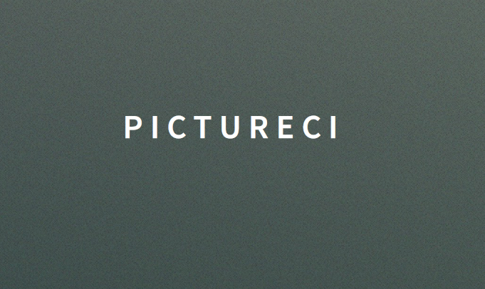

### PicturEci

####Computational Engineering
####Escuela Colombiana De Ingenieria Julio Garavito

Software Architecture 2017-01
Teacher: Hector Fabio Cadavid Rengifo

PicturEci is based on the game "Pictionary" and other similar online,
The game will have the classic modes of competing with a limited time, and words by category, etc ...
The added value of the project lies in a new gameplay that will test the ability to concentrate and
Multitasking of the players, since in addition to a player draws the object that was requested,
In simultaneous also must guess what the other player is drawing,
Ie the two players will have to draw and guess the other player's drawing at the same time! .
And as if that were not enough, will have extreme mode in which randomly any of the strokes of players will be erased,
Thus generating greater difficulty.

A possible future advance in the architecture is considered to guarantee availability, and scalability. A posbile architecture of the same would be this:  

  
Link Drive: https://drive.google.com/drive/folders/0B_4JeHYUqRALVDlVMWJRZmd5Vnc?usp=sharing (Only for teacher and autor )

Link CircleCI : https://circleci.com/gh/leonardoIDS/PicturEci-Arsw 

Link Heroku app:   https://pictureci-arsw.herokuapp.com/
  
  
